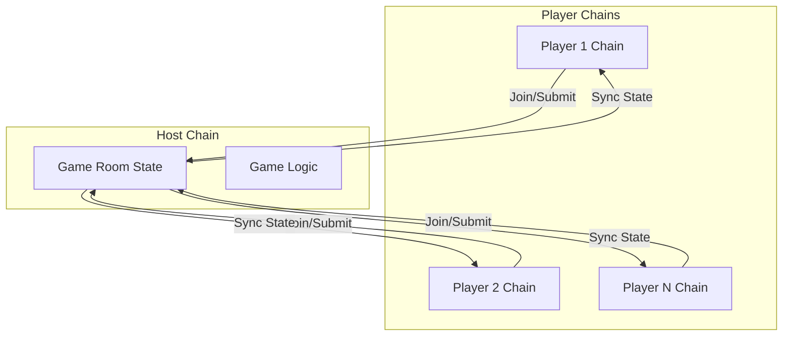

# Type Arena – Linera 🎮⌨️

<p align="center">
  
</p>

## 🎯 Overview

**Type Arena** is a real-time multiplayer typing competition built entirely on the **Linera Layer-1 microchain protocol**. Compete against players worldwide in fast-paced typing races with blockchain-verified results and sub-second finality.

### 🏆 Key Features

- **⚡ Sub-Second Finality**: Every keystroke and result is confirmed instantly
- **🌐 Cross-Chain Multiplayer**: True P2P gaming with microchain synchronization
- **📊 On-Chain Leaderboards**: Immutable rankings stored on-chain
- **🎮 Real-Time Racing**: Watch opponents' progress as you type
- **🔒 Trustless Competition**: No central server, no cheating possible

---

## 🚀 Live Demo

**🌐 Live URL**: [Coming Soon - Deploy to Vercel]

**📺 Demo Video**: [Watch on YouTube](#) *(3-5 minute walkthrough)*

---

## 📋 Deployment Information

### Conway Testnet Deployment

| Property | Value |
|----------|-------|
| **Application ID** | `[To be updated after deployment]` |
| **Chain ID** | `[To be updated after deployment]` |
| **Testnet URL** | `https://testnet-conway.linera.net` |
| **SDK Version** | `0.15.7` |

---

## 🏗️ Architecture

### System Overview



### Microchain Architecture

1. **Microchain Per Player**: Each user connects via their wallet and operates on their own Linera microchain
2. **Host Chain Authority**: The room creator's chain maintains authoritative game state
3. **Cross-Chain Messaging**: Player actions are sent as messages to the host chain
4. **State Synchronization**: Host broadcasts updated state to all player chains

### Cross-Chain Message Flow

```rust
// Player submits typing result
pub enum Message {
    PlayerJoined { player, player_chain_id, player_name },
    GameStarted { prompt, round, start_time },
    ResultSubmitted { player, wpm, accuracy, time_ms },
    SyncState { room_id, state },
}

// Host processes and syncs
self.runtime.prepare_message(Message::SyncState { ... })
    .send_to(player_chain_id);
```

---

## 🛠️ Technology Stack

| Layer | Technology |
|-------|------------|
| **Blockchain** | Linera Protocol (Rust + WebAssembly) |
| **Smart Contracts** | Rust with `linera-sdk 0.15.7` |
| **Frontend** | React 18, TypeScript, Vite |
| **Styling** | TailwindCSS, Framer Motion |
| **Blockchain SDK** | `@linera/client` |

---

## 📦 Quick Start

### Prerequisites

- Docker & Docker Compose
- Node.js 18+ (for local frontend development)
- Rust 1.82+ (for contract development)

### One-Command Docker Setup

```bash
# Clone and run
git clone https://github.com/yourusername/type-arena-linera.git
cd type-arena-linera

# Start all services
docker compose up --build

# Frontend available at http://localhost:3000
```

### Local Development

```bash
# 1. Build contracts
cd contracts/type_arena
cargo build --target wasm32-unknown-unknown --release

# 2. Start frontend
cd ../../frontend
npm install
npm run dev

# Frontend at http://localhost:5173
```

### Deploy to Conway Testnet

```bash
# Run deployment script
chmod +x scripts/deploy.sh
./scripts/deploy.sh

# This will output the Application ID
```

---

## 🎮 How to Play

1. **Connect Wallet**: Click "Connect Wallet" to link your Linera wallet
2. **Create or Join Room**: Create a new arena or join an existing one
3. **Wait for Players**: Host starts the game when ready
4. **Type Fast & Accurate**: Race to complete the prompt first
5. **View Results**: See your WPM, accuracy, and ranking

### Scoring System

```
Score = WPM × (Accuracy/100)²
```

This formula rewards accuracy while still valuing speed. A typist with 100 WPM and 95% accuracy scores higher than one with 120 WPM and 80% accuracy.

---

## 📁 Project Structure

```
Type Arena - Linera/
├── contracts/
│   └── type_arena/
│       ├── Cargo.toml           # Linera SDK 0.15.7
│       ├── src/
│       │   ├── lib.rs           # ABI definitions
│       │   ├── state.rs         # Game state
│       │   ├── contract.rs      # Contract logic
│       │   └── service.rs       # GraphQL API
│       └── tests/
├── frontend/
│   ├── src/
│   │   ├── components/          # React components
│   │   ├── pages/               # Page views
│   │   ├── contexts/            # Linera context
│   │   └── hooks/               # Custom hooks
│   ├── package.json
│   └── vite.config.ts
├── scripts/
│   └── deploy.sh
├── docker-compose.yml
├── Dockerfile
└── README.md
```

---

## 🔗 Linera Integration

### Contract Operations

| Operation | Description |
|-----------|-------------|
| `CreateRoom` | Create a new game room |
| `JoinRoom` | Join an existing room |
| `StartGame` | Host starts the game |
| `SubmitResult` | Submit typing result |
| `LeaveRoom` | Leave current room |

### GraphQL Queries

```graphql
# Get active rooms
query {
  activeRooms {
    roomId
    host
    playerCount
    maxPlayers
    status
  }
}

# Get leaderboard
query {
  leaderboard(limit: 10) {
    player
    gamesWon
    averageWpm
    bestWpm
  }
}
```

---

## 📸 Screenshots

| Home Page | Game Lobby |
|-----------|------------|
|  |  |

| Typing Game | Leaderboard |
|-------------|-------------|
|  |  |

---

## 🔮 Roadmap

### Wave 1 ✅ (Current)
- [x] Core typing game mechanics
- [x] Multiplayer room system
- [x] Cross-chain state sync
- [x] Professional UI

### Wave 2 (Planned)
- [ ] Tournament system
- [ ] Token rewards integration
- [ ] Custom prompts
- [ ] Spectator mode

### Wave 3 (Future)
- [ ] NFT achievements
- [ ] Mobile app
- [ ] AI typing opponents
- [ ] Practice mode with analytics

---

## 👥 Team

Built with ❤️ for **Linera WaveHack**

---

## 📄 License

MIT License - see [LICENSE](./LICENSE) for details

---

## 🙏 Acknowledgments

- [Linera Protocol](https://linera.io) for the revolutionary microchain architecture
- [WaveHack](https://wavehack.linera.io) for the buildathon opportunity

---

<p align="center">
  <strong>Built on Linera. Powered by Microchains. Type to Victory! 🏆</strong>
</p>
